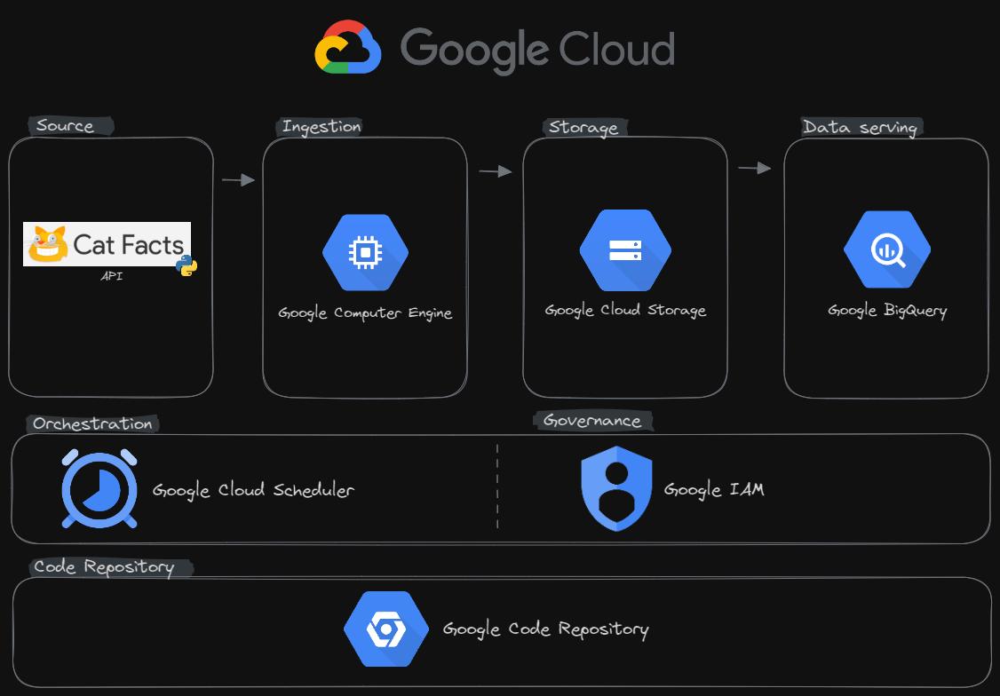

# Step2

A idéia do fluxo é mostrar uma ingestão dos dados da API e disponibiliza-la para o time de analytics fazer consultas.

## Resumo:
> O pipeline desda etapa traz ferramentas da cloud Google que permitem executar o script do step 1 e disponibilizar os dados. O fluxo contém as etapas básicas para um pipeline de ingestão e delivery de dados.

## Fases:
 - Source
	- A origem dos dados é a **Cat Facts**, disponibilizada via API;
 - Ingestion
	- Etapa de execução do script .py. Não é necessário um cluster muito robusto pois o script não exige muita capacidade de máquina visto que apenas acrescentará mais arquivos em diretórios.
 - Storage
	- Aqui deverão ser amazenados os arquivos .csv e .json
		- Recomenda-se ter dois diretórios de armazenamento:
			- **Landing**: Diretório onde deverão ser armazenados os arquivos .json para fins de análises ou rollback.
			- **Raw**: Diretório de armazenamento dos arquivos .csv que serão extraídos na execução do script.
 - Data Serving
	- Aqui os dados estarão disponívels em formato bruto para consulta. No BigQuery será possível apontar as consultas para os arquivos armazenados.
 - Orchestration
	- O Cloud Scheduler deverá conter os agendamentos de execuções. Sugestões de execução em Cron (Diário em determinada hora: `0 10 * * *` ou de hora em hora `0 * * * *`)
 - Governance
	- O Google IAM permitirá fazer a governança de acessos aos arquivos conforme necessário por equipes ou projetos.
 - Code Repository
	- O código deverá estar commitado no Google Code Repository. *Recomenda-se fazer alterações usando branchs conforme boas práticas de versionamento de código.*

## Diagrama:

**[README principal](/README.md)**