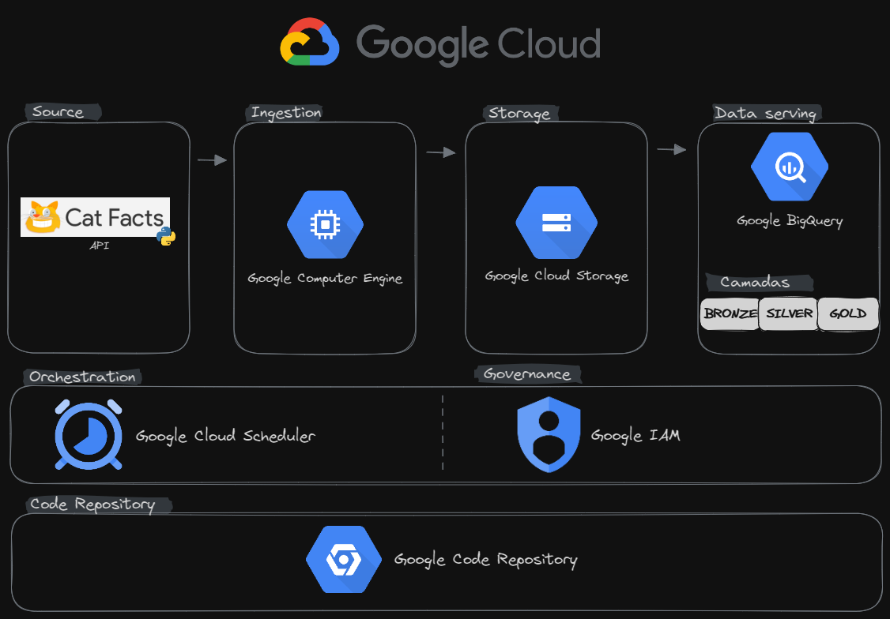

# Step3

A idéia do fluxo é mostrar uma ingestão dos dados da API e disponibiliza-la para o time de analytics fazer consultas.

## Resumo:
> O pipeline desta etapa traz uma alteração na fase de disponibilização do dado que agora consiste em criar as camadas de dados de forma com que o dado seja pré tratado e ajustado.

## Fase acrestentada:
  - Data Serving
	- Agora existem 4 camadas de dados, sendo:
		- **Raw:** Esta camada faz a interação do dado do storage para o dataset do Big Query
		- **Bronze:** Na bronze temos a remoção dos dados duplicados e o ajuste dos nomes dos campos. Os dados duplicados podem vir pois o script de ingestão usou a extação randomica dos dados disponibilidos pela API.
		- **Silver:** Aqui temos as tipagens (string, data, int, etc..) e particionamentos criados.
		- **Gold:** Aqui temos uma tabela útil para data analytics, também particionada.
 

## Diagrama:

**[README principal](/README.md)**